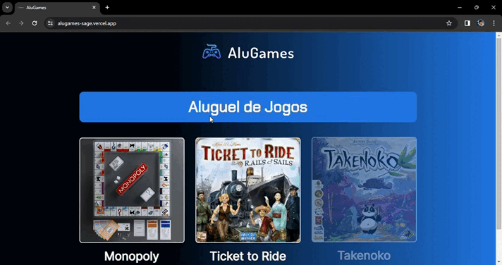

# Alu Games

## About

Alugames is a project intended for my learning of programming logic, with planning as something very simple: when an item is rented, it must have the message to return, and it is necessary to give it a clear opacity highlight so that the user can understand this.

When the item is not rented, it must have a "Rent" message, knowing that the colors for rented and not rented are different so that the user can understand this, without needing to understand the name of the button. When it is rented, it turns black with the title to return, when it is not, it will just turn blue, indicating that it can be rented in the future.

## Layout

Here is the link to access the project - deploy:
[Alu Games](https://alugames-sage.vercel.app/).



## How to execute the project?

```bash
# Terminal

git clone https://gitlab.com/mateusdev3400/alugames
git clone https://github.com/mateusdev3400/alugames

cd alugames/

index.html # Live Server / C://
```

## Technologies

The following tools were used in the construction of the project:

### Frontend

- HTML5
- CSS3
- JavaScript

## Contributors

<table>
    <thead>
        <tr>
            <td>
                
            </td>
        </tr>
    </thead>
    <tbody>
        <tr>
            <th>Mateus Maciel</th>
        </tr>
    </tbody>
</table>

### How to contribute

- Fork the project.
- Create a new branch with your changes: ```bash git checkout -b my-feature```
- Save the changes and create a confirmation message telling you what you did: ```git commit -m "modified file"```
- Submit your changes: ```git push origin my-feature```

## Licença

This project is licensed under the Alura Cursos license.